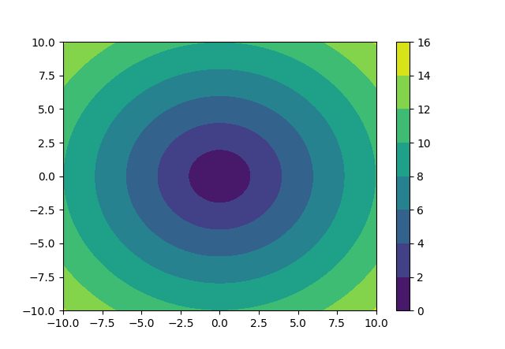

# small-project
**Small warm-up and fun projects using Python and C++.**

---
## Table of Contents
1. [Introduction](#introduction)
2. [Setup and Requirements](#setup-and-requirements)
3. [Repository Structure](#repository-structure)
4. [Circle Contours](#circle-contours)
   - [Theory](#theory-1)
   - [Usage](#usage-1)
5. [Surface of Cylinders](#surface-of-cylinders)
   - [Theory](#theory-2)
   - [Usage](#usage-2)
6. [Future Additions](#future-additions)
7. [Contributing](#contributing)
8. [License](#license)
9. [References](#references)


## Introduction
This repository contains **mini fun and warm up projects**. The current projects are:

- [**Circle Contours**](#circle-contours)
- [**Surface of Cylinders**](#surface-of-cylinder)

## Setup and Requirements
### Python
Python projects were written in `Python3.x` so at least `python3.8` is needed. Used libraries;
- **NumPy** (`pip install numpy`)  
- **Matplotlib** (`pip install matplotlib`)  

### C++
No projects have been written in C++ yet. They are upcoming.

## Repository Structure
- **circle_contours.py** : Plots colored contour lines for a circular function.  
- **surface_of_cylinders.py** : Demonstrates OOP in Python by modeling circles and cylinders.

## Circle Contours
File: `circle_contours.py`

### Theory
This script creates a **contour plot** for the function:$z = \sqrt{x^2 + y^2}$ where (x, y) form a meshgrid ranging from -10 to +10 on both axes. Each contour line represents points at the same distance from the origin (0, 0). The result is a **series of concentric circles**, each colored differently.

**Why Use Contour Plots?**  
- They provide a 2D way to visualize **3D** surfaces.
- Useful for understanding **radial distances** or **levels** in a data set.

### Usage
1. **Install** dependencies:
   ```bash
   pip install numpy matplotlib
   ```
2. **Run** the script:
  ```bash
  python3 circle_contours.py
  ```
3. A **matplotlib** window displays the filled contour plot with a colorbar. You’ll see circular bands of color radiating outward from the origin.


