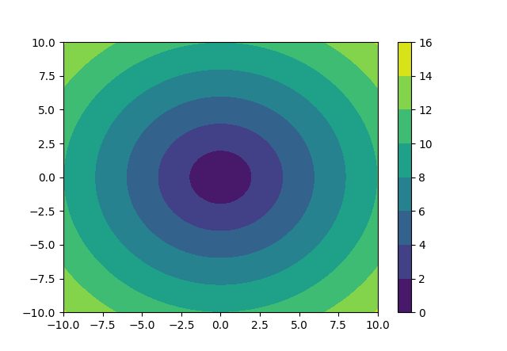

# small-project
**Small warm-up and fun projects using Python and C++.**

---
## Table of Contents
1. [Introduction](#introduction)
2. [Setup and Requirements](#setup-and-requirements)
3. [Repository Structure](#repository-structure)
4. [Circle Contours](#circle-contours)
   - [Theory](#theory-1)
   - [Usage](#usage-1)
5. [Surface of Cylinders](#surface-of-cylinders)
   - [Theory](#theory-2)
   - [Usage](#usage-2)
6. [Future Additions](#future-additions)
7. [Contributing](#contributing)
8. [License](#license)
9. [References](#references)


## Introduction
This repository contains **mini fun and warm up projects**. The current projects are:

- [**Circle Contours**](#circle-contours)
- [**Surface of Cylinders**](#surface-of-cylinder)

## Setup and Requirements
### Python
Python projects were written in `Python3.x` so at least `python3.8` is needed. Used libraries;
- **NumPy** (`pip install numpy`)  
- **Matplotlib** (`pip install matplotlib`)  

### C++
No projects have been written in C++ yet. They are upcoming.

## Repository Structure
- **./Circle-contours/**
 - `circle_contours.py` : Plots colored contour lines for a circular function.  
- **./Surface-of-Cylinder/**
 - `surface_of_cylinders.py` : Demonstrates OOP in Python by modeling circles and cylinders.

## Circle Contours
File: `circle_contours.py`

### Theory
This script creates a **contour plot** for the function:$z = \sqrt{x^2 + y^2}$ where (x, y) form a meshgrid ranging from -10 to +10 on both axes. Each contour line represents points at the same distance from the origin (0, 0). The result is a **series of concentric circles**, each colored differently.

**Why Use Contour Plots ?**  
- They provide a 2D way to visualize **3D** surfaces.
- Useful for understanding **radial distances** or **levels** in a data set.

### Usage
1. **Install** dependencies:
   ```bash
   pip install numpy matplotlib
   ```
2. **Run** the script:
  ```bash
  python3 circle_contours.py
  ```
3. A **matplotlib** window displays the filled contour plot with a colorbar. You’ll see circular bands of color radiating outward from the origin.



## Surface of Cylinders<sup>[1](https://www.geeksforgeeks.org/surface-area-of-cylinder/)</sup>
File: `surface_of_cylinders.py`

### Theory

A **cylinder** can be thought of as two parallel circles (top and bottom) plus a “curved surface” that, if cut and flattened, forms a **rectangle**.

- **Top and Bottom Circles**:
  - **Radius**: r
  - **Area**: $\pi$r<sup>2</sup>

- **Curved (Lateral) Surface**:
  - **Unrolled** into a rectangle with:
    - **Height**: h
    - **Width**: the **perimeter (circumference)** of the circle, 2$\pi$r
  - **Area**: Perimeter * Height = 2$\pi$rh

Putting these together, the **total surface area** S of a **closed** cylinder is:
$$S = 2(\pi r<sup>2</sup>) + 2\pi rh$$
1. 2($\pi$r<sup>2</sup>) accounts for the **top** and **bottom** circles.
2. 2$\pi$rh is the **curved surface**.

The **volume** of a cylinder is based on the **area of the circle’s base** multiplied by the **height**:
$$Volume = \pi r^2h$$


#### **Structure of Classes**
In this mini-project, there are two classes:

1. **Circle**  
   - **Attributes**:
     - `radius`
   - **Methods**:
     - `get_area()`: returns $\pi$r<sup>2</sup>
     - `get_perimeter()`: returns 2$\pi$r

2. **Cylinder** (inherits from **Circle**)
   - **Attributes**:
     - `height`
     - (inherits `radius` from `Circle`)
   - **Methods**:
     - `get_volume()`: uses circle’s area * height implies $\pi$r<sup>2</sup>h
     - `get_surface()`: uses the cylinder surface area formula: 2$\pi$r<sup>2</sup> + 2$\pi$rh

By extending **Circle** with **Cylinder**, we can reuse `Circle`’s methods (`get_area`, `get_perimeter`) for computing the volume and surface of a cylinder.

### Usage

1. **Run** the script:
   ```bash
   python3 surface_of_cylinders.py
   ```
2. **Follow** the prompts on the terminal to enter radius and height for cylinder. An example input and output prompts are:

    ```bash
    Enter radius: 5
    Circle with radius 5
    Area of the Circle is 78.53981633974483
    Perimeter of the circle is 31.41592653589793

    Enter height of cylinder: 10
    Cylinder with height 10 and radius 5
    Cylinder's volume is 785.3981633974483
    Cylinder's surface area is 502.6548245743669

    ```
